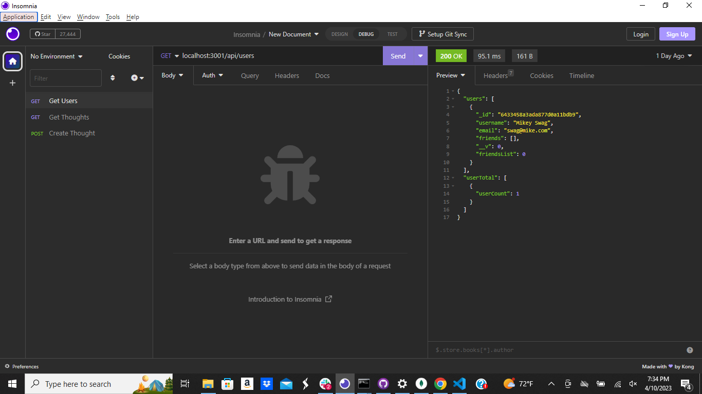

# Social-Network-API
NoSQL Challenge: Social Network API

## Description
This application utilizes MongoDB to store data for my social media application. For this project, I created a back-end system that allows users to perform CRUD operations. The client can create new users and thought for the social media application. 

# Table of Contents

 * [Installation](#installation)
 * [Usage](#usage)
 * [License](#license)
 * [Contributors](#contributors)
 * [Questions](#questions)
    

## Installation

To install this program, clone GitHub SSH below, use your terminal and enter "node index.js", this will initiate the main script. and then install dependencies by entering "NPM i" and then can update by adding users and thoughts

git@github.com:Mrose332/Social-Network-API.git

## License
Project is license under MIT

## Usage 

<a href=https://drive.google.com/file/d/1O_JBMYLN_KSbLN2dL9VXHNpbWQixKItE/view>Link to Video</a>

## Contributors

Mike Rosenzweig

## Questions

Reach me for additional questions at: mailto:mrose332@gmail.com.

